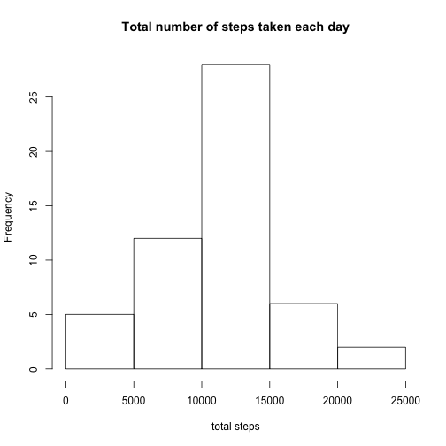
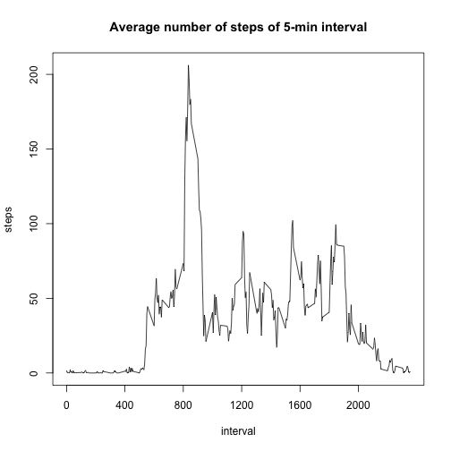
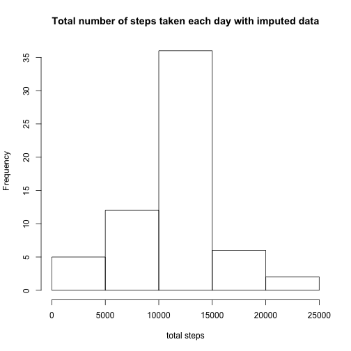

---
title: 'Reproducible Research: Peer Assessment 1'
output:
  pdf_document: default
  html_document:
    keep_md: yes
---


## Loading and preprocessing the data

```r
data = read.csv(file = "activity.csv", header = TRUE, sep = ",",na.strings= "NA",stringsAsFactors = FALSE)
data$date= as.Date(data$date,format = "%Y-%m-%d")
```
## What is mean total number of steps taken per day?


```r
aggTotals = aggregate(steps ~ date,data, FUN=sum,na.action= na.omit)
hist(aggTotals$steps,
     main = "Total number of steps taken each day",
     xlab = "total steps")
```

 

The mean and median of total number of steps taken per day are **$10766.19$** and **$10765$**, respectively.

## What is the average daily activity pattern?

```r
aggTotals = aggregate(steps ~ interval,data, FUN=mean,na.action= na.omit)
plot(aggTotals$interval,aggTotals$steps,type = "l",xlab = "", ylab="",xaxt="n")
axis(side=1,at = seq(from = min(aggTotals$interval), to =max(aggTotals$interval), by = 400))
title(main = "Average number of steps of 5-min interval",xlab= "interval",ylab = "steps")
```

 

The **$835$** 5-min interval, on average across all the days in the dataset, contains the maximum number of steps.

## Imputing missing values
1. The total number of rows with NAs are $2304$.
2. Impute missing values by **the mean for that 5-min interval**

```r
aggTotals = aggregate(steps ~ interval,data, FUN=mean,na.action= na.omit)
missing_idx = which(is.na(data$steps))
for (i in missing_idx ) {
  interval = data$interval[i]
  mean_steps = aggTotals$steps[aggTotals$interval==interval]
  data$steps[i]=mean_steps
}
```

3. Create a new dataset that is equal to the original dataset but with the missing data filled in.

```r
head(data)
```

```
##       steps       date interval
## 1 1.7169811 2012-10-01        0
## 2 0.3396226 2012-10-01        5
## 3 0.1320755 2012-10-01       10
## 4 0.1509434 2012-10-01       15
## 5 0.0754717 2012-10-01       20
## 6 2.0943396 2012-10-01       25
```

4. Make a histogram of the total number of steps taken each day and Calculate and report the mean and median total number of steps taken per day.


```r
aggTotals = aggregate(steps ~ date,data, FUN=sum,na.action= na.omit)
hist(aggTotals$steps,
     main = "Total number of steps taken each day with imputed data",
     xlab = "total steps")
```

 

The mean and median of total number of steps taken per day are $10766.19$ and $10766.19$, respectively. These values are close to the values from first part. Missing value imputation doesn't skew the distribution of original data.

## Are there differences in activity patterns between weekdays and weekends?

```r
library(chron)
library(lattice)
data$weekend = is.weekend(data$date)
data$weekend[data$weekend==TRUE] = "weekend"
data$weekend[data$weekend==FALSE] = "weekday"
aggTotals = aggregate(steps ~ interval + weekend,data, FUN=mean,na.action= na.omit)
xyplot(aggTotals$steps ~ aggTotals$interval | aggTotals$weekend, 
       layout = c(1, 2), type = "l", 
       xlab = "Interval", ylab = "Number of steps")
```

 
